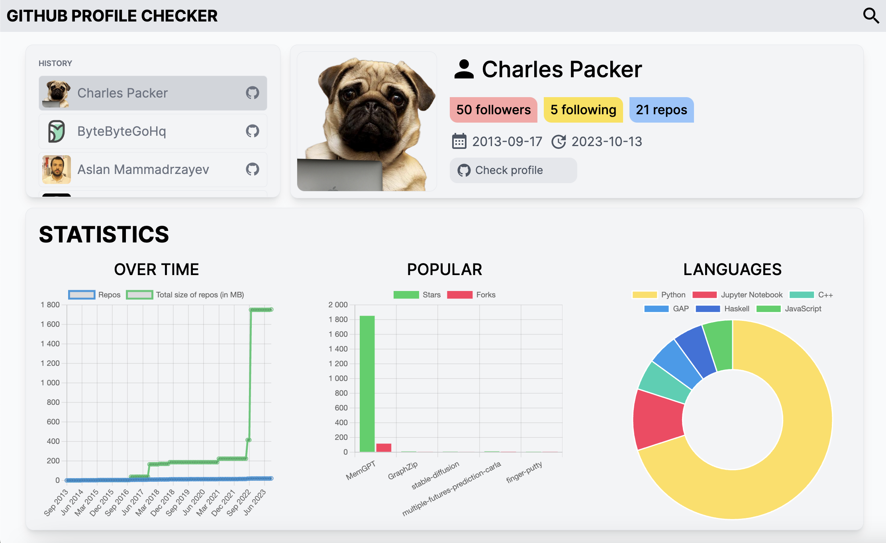

# Github profiles checker

> Github profile information checker with user-friendly interface and functionality

## Preview



## Features

- Vue 3
- TypeScript
- Tailwind CSS
- Element Plus
- ChartsJS
- Pinia
- Vue Router
- ESLint

## Project setup and usage

Install dependencies:

```
npm install
```

Run development server:

```
npm run dev
```

Build for produciton:

```
npm run build
```

Run ESLint:

```
npm run lint
```

Lint and fix:

```
npm run lint:fix
```

## Contributing

Contributions, feedback and issues are welcome. Feel free to fork, comment, critique, or submit a pull request.
